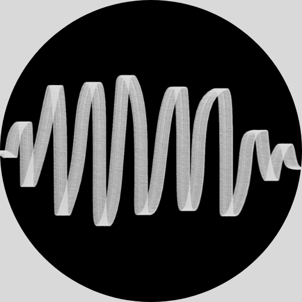

# DeepAudioX

[](https://pypi.org/project/deepaudio-x/)
[](https://pypi.org/project/deepaudio-x/)
[](https://github.com/magcil/deepaudio-x/blob/main/LICENSE)
[](https://github.com/magcil/deepaudio-x/actions/workflows/tests.yml)

<p align="left">
  
</p>


DeepAudioX is a PyTorch-based library that provides **simple, flexible pipelines for audio classification** using **pretrained audio foundation models** as feature extractors.

It is designed to let users train, evaluate, and run inference on **custom audio datasets** with only a few lines of code, while still allowing advanced customization when needed.

## Key Features

- 🔊 **Pretrained audio backbones** for feature extraction  
- 🧠 **Modular pooling strategies** (e.g. GAP, SimPool, EfficientProbing)
- 🧩 **Custom classifier heads** for downstream audio classification
- 🚀 **High-level training, evaluation, and inference APIs**
- 🔁 Fully **PyTorch-native** and extensible
- 📦 Clean integration with existing PyTorch workflows

---

## Installation

For PyPI installs, we recommend creating a virtual environment with a supported Python version first.

### Virtual Environment

DeepAudioX supports Python 3.11, 3.12, and 3.13. You can create a virtual environment using `uv` or Miniconda and then install DeepAudioX from PyPI.

**Option A: uv (recommended)**

Install `uv` following the official guide (see: [Astral uv installation docs](https://docs.astral.sh/uv/getting-started/installation/)), then create a virtual environment:

```bash
uv venv --python 3.12 .venv
source .venv/bin/activate
pip install deepaudio-x
```

**Option B: Miniconda**

```bash
conda create -n deepaudiox python=3.12
conda activate deepaudiox
pip install deepaudio-x
```

### Install From Source

Clone the repo and use `uv sync` to install dependencies from `pyproject.toml`:

```bash
git@github.com:magcil/deepaudio-x.git
cd deepaudio-x
uv sync
```
---

## Quick Start

### Creating an Audio Classification Dataset

DeepAudioX provides flexible dataset creation methods for audio classification tasks. Here are the main approaches:

#### Method 1: From Directory Structure

If your audio files are organized in subdirectories where each subdirectory name is a class label:

```
data/
├── speech/
│   ├── audio1.wav
│   ├── audio2.wav
│   └── ...
├── music/
│   ├── audio3.wav
│   ├── audio4.wav
│   └── ...
└── noise/
    ├── audio5.wav
    └── ...
```

You can load the dataset as follows:

```python
from deepaudiox import audio_classification_dataset_from_dir
from deepaudiox.utils.training_utils import get_class_mapping_from_dir

# Define a class mapping
class_mapping = get_class_mapping_from_dir(root_dir="path/to/data")

dataset = audio_classification_dataset_from_dir(
    root_dir="path/to/data",
    sample_rate=16_000,  # sampling rate in Hz
    class_mapping=class_mapping
)
```

#### Method 2: From Custom File-to-Class Mapping

If your audio files aren't organized in subdirectories, or you need custom mappings, you can create a dictionary mapping file paths to class labels:

```python
from deepaudiox import audio_classification_dataset_from_dictionary

# Create a file-to-class mapping
file_to_class_mapping = {
    "path/to/audio1.wav": "speech",
    "path/to/audio2.wav": "speech",
    "path/to/audio3.wav": "music",
    # ... more mappings
}

# Create a class-to-id mapping
class_mapping = {"speech": 0, "music": 1, "noise": 2}

# Initialize the dataset
dataset = audio_classification_dataset_from_dictionary(
    file_to_class_mapping=file_to_class_mapping,
    sample_rate=16_000,
    class_mapping=class_mapping
)
```

#### Audio Segmentation

To split long audio files into fixed-duration segments, use the `segment_duration` parameter:

```python
# Create dataset with 2-second audio segments
dataset = audio_classification_dataset_from_dir(
    root_dir="path/to/data",
    sample_rate=16_000,
    segment_duration=2.0,  # Duration in seconds
    class_mapping=class_mapping
)
```

When `segment_duration` is specified, each audio file is divided into non-overlapping segments of the given duration. Each segment is treated as an independent sample in the dataset, with the same class label as the original audio file. The `segment_idx` field in the dataset output indicates which segment a sample corresponds to.

**Example**: A 10-second audio file with `segment_duration=2.0` will produce 5 separate samples, each 2 seconds long, all with the same class label.

Both methods return an `AudioClassificationDataset` object that can be used with PyTorch's DataLoader for training and evaluation.

#### Dataset Output Format

Each item returned by the dataset is a dictionary containing:

```python
{
    "path": str,                # File path of the audio
    "y_true": int,              # Integer class ID
    "class_name": str,          # String class label
    "segment_idx": int,         # Segment index (for segmented audio)
    "feature": np.ndarray       # Audio waveform as numpy array
}
```

Example usage:

```python
from torch.utils.data import DataLoader

dataloader = DataLoader(dataset, batch_size=32)

for batch in dataloader:
    paths = batch["path"]           # File paths
    class_ids = batch["y_true"]     # Shape: (batch_size,)
    class_names = batch["class_name"]  # Class names
    segment_indices = batch["segment_idx"]  # Segment indices
    waveforms = batch["feature"]    # Shape: (batch_size, num_samples)
```

## Create an Audio Classifier with Pretrained Backbone

DeepAudioX simplifies the creation of audio classifiers by combining pretrained audio backbones with custom classifier heads. Here's how to build and configure a classifier:

### Basic Setup

```python
from deepaudiox import AudioClassifier

# Initialize classifier with pretrained BEATs backbone
classifier = AudioClassifier(
    num_classes=10,              # Number of output classes
    backbone="beats",            # Pretrained backbone (e.g., "beats")
    sample_rate=16_000,          # Audio sample rate
    pretrained=True,             # Use pretrained weights
    freeze_backbone=True         # Freeze backbone for fine-tuning
)
```

**Note**: When `pretrained=True`, the BEATs model will be automatically downloaded and cached in your OS-specific cache directory (e.g., `~/.cache` on Linux). The library does not contain pretrained model files (`.pt` files), keeping the repository lightweight. Subsequent uses will load the model from the cache.

### Available Backbones

- **BEATs** (`"beats"`): BEATs: Audio Pre-Training with Acoustic Tokenizers (https://arxiv.org/abs/2212.09058)
- **PaSST** (`"passt"`): Efficient Training of Audio Transformers with Patchout (https://arxiv.org/abs/2110.05069)

### Key Parameters

- `num_classes`: Number of output classification classes
- `sample_rate`: Audio sampling rate (Hz) - must match your dataset
- `pretrained`: Whether to use pretrained weights (recommended)
- `freeze_backbone`: Freeze backbone parameters during training (reduces parameters to fine-tune)

### Optional: Custom Pooling Strategies

You can customize the pooling strategy used to aggregate audio features:

```python

classifier = AudioClassifier(
    num_classes=10,
    backbone="beats",
    sample_rate=16_000,
    pretrained=True,
    freeze_backbone=True,
    pooling="gap"
)
```

**Supported pooling names**: `"gap"`, `"simpool"`, `"ep"`

### Backbone-Only Usage

If you only need the pretrained backbone (for feature extraction or custom heads), you can instantiate it directly with `Backbone`:

```python
from deepaudiox import Backbone

backbone = Backbone(
    backbone="beats",
    pretrained=True,
    freeze_backbone=True,
    pooling="gap",
    sample_rate=16_000
)
```

You can access both the raw backbone output and the pooled embeddings:

```python
import torch

waveforms = torch.randn(2, 5 * 16_000)  # (batch, samples)

features = backbone.forward(waveforms)  # raw backbone features: (B, N, D) for Transformer or (B, D, H, W) for CNN
embeddings = backbone.forward_with_pooling(waveforms)  # pooled embeddings
```

### Input and Output Expectations

- Inputs to backbones and classifiers are mono waveforms shaped `(B, T)` where `T` depends on sample rate and duration.
- `AudioClassifier` outputs logits shaped `(B, num_classes)`.
- `Backbone.forward(...)` returns either `(B, N, D)` for Transformer backbones or `(B, D, H, W)` for CNN backbones.
- `Backbone.forward_with_pooling(...)` returns pooled embeddings shaped `(B, D)`.

Available pooling strategies include:
- **GAP**: Simple average pooling
- **SimPool**: As presented in "Keep It SimPool: Who Said Supervised Transformers Suffer from Attention Deficit?" (https://arxiv.org/pdf/2309.06891)
- **EP**: As presented in "Attention, Please! Revisiting Attentive Probing Through the Lens of Efficiency"(https://arxiv.org/abs/2506.10178)

Normally, attentive pooling methods like ep and simpool will perform better than the Global Average Pooling (GAP).

The classifier is now ready for training or inference.

## Training

Train your audio classifier with a few lines of code using the built-in `Trainer` class:

#### Minimal Example (Recommended)

```python
from deepaudiox import Trainer

# Initialize trainer with defaults
trainer = Trainer(
    train_dset=train_dataset,
    model=classifier,
    validation_dset=val_dataset,  # Optional
    batch_size=32,
    epochs=100,
    num_workers=4,
    patience=20
)

# Start training
trainer.train()
```

By default, the trainer uses:
- **Optimizer**: Adam with learning rate `1e-3`
- **Scheduler**: ReduceLROnPlateau with patience `10`

#### Advanced: Custom Optimizer and Scheduler

For more control, you can provide custom optimizer and learning rate scheduler:

```python
from torch.optim import Adam
from torch.optim.lr_scheduler import CosineAnnealingLR
from deepaudiox import Trainer

optimizer = Adam(classifier.parameters(), lr=1e-2)
lr_scheduler = CosineAnnealingLR(optimizer=optimizer, T_max=100, eta_min=1e-6)

trainer = Trainer(
    train_dset=train_dataset,
    model=classifier,
    validation_dset=val_dataset,
    optimizer=optimizer,
    lr_scheduler=lr_scheduler,
    batch_size=32,
    epochs=100,
    num_workers=4,
    patience=20,
    path_to_checkpoint="checkpoint.pt"
)

trainer.train()
```

### Trainer Parameters

- `train_dset`: Training dataset (AudioClassificationDataset)
- `model`: Audio classifier model to train
- `validation_dset`: Optional validation dataset for monitoring (if None, will split from train_dset)
- `optimizer`: Optional custom PyTorch optimizer (default: Adam with lr=1e-3)
- `lr_scheduler`: Optional custom learning rate scheduler (default: ReduceLROnPlateau with patience=10)
- `batch_size`: Number of samples per batch (default: 16)
- `epochs`: Maximum number of training epochs (default: 100)
- `patience`: Number of epochs with no improvement before early stopping (default: 15)
- `num_workers`: Number of workers for data loading (default: 4)
- `path_to_checkpoint`: Path to save the best model checkpoint (default: "checkpoint.pt")

### Features

- **Automatic Checkpointing**: Saves the best model based on validation loss
- **Early Stopping**: Stops training when validation loss plateaus
- **Progress Tracking**: Displays training progress with loss metrics
- **Device Agnostic**: Automatically detects and uses GPU if available

## Evaluate

Evaluate your trained classifier on a test dataset using the `Evaluator` class:

```python
import torch

from deepaudiox import Evaluator

# Initialize evaluator
evaluator = Evaluator(
    test_dset=test_dataset,
    model=classifier,
    class_mapping=class_mapping,
    batch_size=32,
    num_workers=4
)

# Load model
classifier.load_state_dict(torch.load("checkpoint.pt"))

# Run evaluation
evaluator.evaluate()

# Access evaluation results
y_true = evaluator.state.y_true       # True labels
y_pred = evaluator.state.y_pred       # Predicted labels
posteriors = evaluator.state.posteriors  # Prediction probabilities
```

### Evaluator Parameters

- `test_dset`: Test dataset (AudioClassificationDataset)
- `model`: Trained audio classifier model
- `class_mapping`: Dictionary mapping class names to IDs
- `batch_size`: Number of samples per batch (default: 16)
- `num_workers`: Number of workers for data loading (default: 4)
- `device_index`: GPU device index to use (optional, auto-detects by default)

### Evaluation Results

The evaluator stores predictions in its state:
- `y_true`: Ground truth labels as NumPy array
- `y_pred`: Predicted class IDs as NumPy array
- `posteriors`: Class probability distributions as NumPy array

You can use these results to compute metrics like accuracy, precision, recall, F1-score, etc.:

```python
from sklearn.metrics import accuracy_score, classification_report

accuracy = accuracy_score(evaluator.state.y_true, evaluator.state.y_pred)
print(f"Accuracy: {accuracy:.4f}")
print(classification_report(evaluator.state.y_true, evaluator.state.y_pred))
```

---

## Running Inference

The `BaseAudioClassifier` exposes two convenience methods for inference on raw waveforms or audio files.

Both methods return a dictionary with:
- `final_label`: Predicted class label (string).
- `final_posterior`: Posterior probability for the predicted class.
- `segment_labels`: List of per-segment labels (only when `segment_duration` is used and the audio is longer than that duration).
- `segment_posteriors`: List of per-segment posteriors aligned with `segment_labels` (only when `segment_duration` is used and the audio is longer than that duration).

The `segment_duration` argument (in seconds) enables segment-level inference. If provided and the audio is longer than the segment length, the waveform is split into equal segments, each segment is classified, and the final label is chosen by majority vote (ties are resolved by higher mean posterior for the class).

### `inference_on_waveform`

Use this when you already have a waveform tensor or NumPy array.

```python
import torch
from deepaudiox import AudioClassifier

classifier = AudioClassifier(
    backbone="beats",
    num_classes=2,
    sample_rate=16_000,
    pretrained=True,
)

class_mapping = {"dog": 0, "cat": 1}
waveform = torch.randn(5 * 16_000)  # 5 seconds of mono audio

prediction = classifier.inference_on_waveform(
    waveform,
    sample_rate=16_000,
    class_mapping=class_mapping,
    segment_duration=1.0,  # Optional: segment-level inference with majority vote
)

print(prediction)
```

### `inference_on_file`

Use this when you want the model to load audio directly from disk.

```python
from deepaudiox import AudioClassifier

classifier = AudioClassifier(
    backbone="beats",
    num_classes=2,
    sample_rate=16_000,
    pretrained=True,
)

class_mapping = {"dog": 0, "cat": 1}

prediction = classifier.inference_on_file(
    "data/example.wav",
    sample_rate=16_000,
    class_mapping=class_mapping,
    segment_duration=2.0,  # Optional
)

print(prediction)
```

---


## Customization

Advanced users can:

- **Plug in custom backbones** - Implement your own audio feature extractors
- **Implement new pooling layers** - Create custom aggregation strategies for sequence features
- **Define custom classifier heads** - Design specialized classification architectures
- **Override training loops** - Customize the training process while keeping the pipeline structure

The library is designed to scale from quick experiments to research and production use.

---

## Project Status

🚧 This project is under active development.

APIs may evolve, but backward compatibility will be considered once a stable release is reached.

---

## Attribution

This project is developed at MagCIL and is created and primarily maintained by:

- Christos Nikou ([@ChrisNick92](https://github.com/ChrisNick92))
- Stefanos Vlachos ([@stefanos-vlachos](https://github.com/stefanos-vlachos))
- Ellie Vakalaki ([@ellievak](https://github.com/ellievak))

---

## Citation

If you use this library in academic work, please cite:

```bibtex
@software{DeepAudioX,
  author = {Nikou, Christos and Vlachos, Stefanos and Vakalaki, Ellie and Giannakopoulos, Theodoros},
  title = {DeepAudioX: A PyTorch-based audio classification framework},
  year = {2026},
  url = {https://github.com/magcil/deepaudio-x}
}
```

---

## Contributing

Contributions are welcome!

Please open an issue to discuss major changes before submitting a pull request.

---
